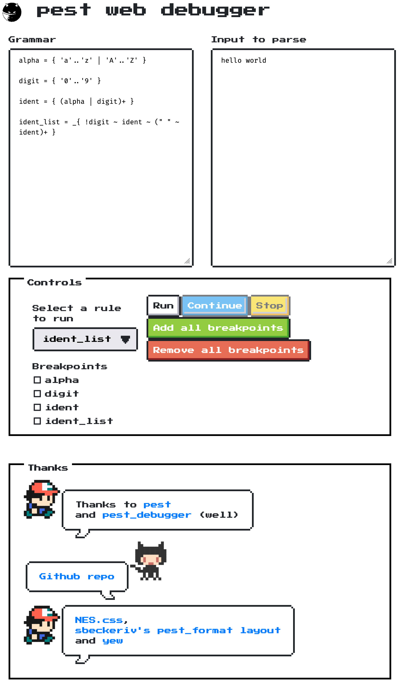

# pest web debugger



This is a simple web-based debugger for the [pest](https://pest.rs/) parser generator using Yew.

## Known limitations
Besides the limitations of [pest_debugger](https://docs.rs/pest_debugger/latest/pest_debugger/#current-limitations), it is not possible to change the breakpoints while the parser is running. This is because the parser is not paused when hitting a breakpoint,
but it just collects the encountered breakpoints until the end of the parsing.
Some problematic grammars could, thus, potentially exhaust the memory
in this naive web-based debugger.

### In detail
At this moment, [pest_debugger](https://docs.rs/pest_debugger/latest/pest_debugger/#current-limitations) works in a bit hacky way by spawning a new OS thread for the parsing process. This thread is then paused when hitting a breakpoint. The thread is resumed when the user instructs to continue in the debugger interface.

This way proved to be challenging in the browser setting:

1. Spawning a new thread (`std::thread::spawn`) will panic / is not supported in `wasm32-unknown-unknown`.
2. The wasm-bindgen's or yew-agent's equivalents, such as `spawn_local` or `WorkerLink`, did not seem to play
well with the [pest_vm's listener function interface](https://docs.rs/pest_vm/latest/pest_vm/struct.Vm.html#method.new_with_listener) that requires ` Sync + Send + RefUnwindSafe + UnwindSafe` trait bounds which are not implemented when using wasm-bindgen's or yew-agent's equivalents
(due to their thread-unsafe internals).

## Build instructions

### Prerequisites
```bash
rustup target add wasm32-unknown-unknown
cargo install trunk wasm-bindgen-cli
```

### Running
```bash
trunk serve
```

### Release
```bash
trunk build --release
```
